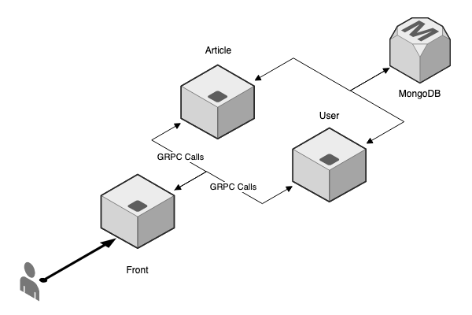

## Example blog application

A microservice application consists of a collection of small two services.

Please note that, this application is just example.

### Prerequisites

* Go
* Python 3
* MongoDB
* Protocol buffers

### Architecture

<p align="center">
    
</p>

### Example

#### Create user account

```bash
$ curl -XGET -G http://localhost:8003/user/sign-up \
    -d user=test -d pass=test
```

#### Sign in

```bash
$ curl -XGET -G http://localhost:8003/user/sign-in \
    -d user=test -d pass=test
```

#### Create article

```bash
$ curl -XGET -G localhost:8003/article/create \
    -d id=62ab199221328dc789c58a7a -d user_id=1 \
    -d title=Test -d description=Test+content 
```

#### List articles

```bash
$ curl -XGET http://localhost:8003/article/list
```
